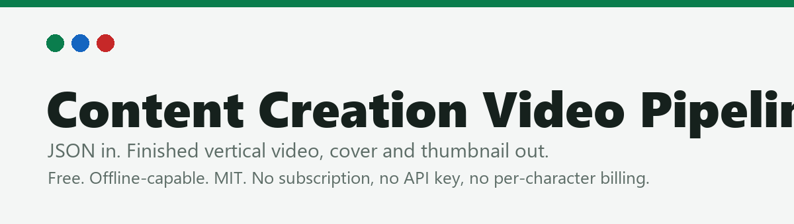

<p align="center">
  
</p>

<h1 align="center">Content Creation Video Pipeline</h1>

<p align="center"><strong>Write a JSON file. Get a finished vertical video, a feed cover and a YouTube thumbnail.</strong></p>

<p align="center">
  <a href="#showcase">Showcase</a> &nbsp;·&nbsp;
  <a href="#quick-start">Quick Start</a> &nbsp;·&nbsp;
  <a href="#formats">Formats</a> &nbsp;·&nbsp;
  <a href="#voices">Voices</a> &nbsp;·&nbsp;
  <a href="#editing">Editing</a> &nbsp;·&nbsp;
  <a href="COMMERCIAL-USE.md">Licensing</a> &nbsp;·&nbsp;
  <a href="TOOLBOX.md">Toolbox</a>
</p>

<p align="center">
  <a href="LICENSE"></a>
  
  
  
  
</p>

---

**No subscription. No API key in the default setup. No per-character billing.** Nothing in this
package has a paid tier you can hit, and nothing sends your script to a third party unless you
explicitly turn that on.

```bash
python make.py examples/morning_routine.json
```

```
[1/5] narration (edge)      [2/5] animation      [3/5] music bed
[4/5] mix and cover         [5/5] checks
  peak luma        226.7  ok
  ship checklist   passed

  video  out/morning_routine.mp4
  cover  out/morning_routine_cover.jpg      (1080x1920 reel/short tile)
  thumb  out/morning_routine_thumbnail.jpg  (1280x720 YouTube card)
```

---

## Showcase

Every clip below was produced by this repository, from the JSON file named beneath it.
No paid API, no stock footage, no manual editing. Previews are trimmed and downsampled —
the real output is 1080×1920 at 30 fps with narration and a music bed.

<table>
<tr>
<td width="25%" align="center"><br><sub><b>listicle</b></sub></td>
<td width="25%" align="center"><br><sub><b>myth</b></sub></td>
<td width="25%" align="center"><br><sub><b>quote</b></sub></td>
<td width="25%" align="center"><br><sub><b>map</b></sub></td>
</tr>
<tr>
<td valign="top"><sub><a href="examples/morning_routine.json">morning_routine.json</a> — numbered points revealed in time with the narration. 42s.</sub></td>
<td valign="top"><sub><a href="examples/productivity_myths.json">productivity_myths.json</a> — alternating claim / correction panels. 37s.</sub></td>
<td valign="top"><sub><a href="examples/ship_it.json">ship_it.json</a> — large statements against an accent rule. 23s.</sub></td>
<td valign="top"><sub><a href="examples/map_projections.json">map_projections.json</a> — real Natural Earth borders and projections. 28s.</sub></td>
</tr>
</table>

Full-resolution MP4s are in [`docs/showcase/`](docs/showcase). The map short cuts from Mercator
to Equal Earth to *demonstrate* the distortion rather than assert it — the geometry is real,
drawn from public-domain Natural Earth data.

---

## What you'd otherwise pay for

| What you want | The usual bill | Here |
|---|---|---|
| Natural narration | ElevenLabs, from $5/mo, metered per character | **Kokoro-82M** (Apache-2.0), unmetered |
| Voice cloning | ElevenLabs Creator, $22/mo | **Chatterbox** or **F5-TTS**, MIT, on your machine |
| Script → video | Pictory, from $19/mo | `python make.py spec.json` |
| Auto captions | Most editors charge for it | **whisper.cpp** (MIT), or free from beat timings |
| Stock footage | Storyblocks, from $15/mo | **Pexels**, **Pixabay**, **Wikimedia Commons** |
| Music that won't get claimed | Epidemic Sound, $10/mo | **Synthesised here from sine waves** |
| Thumbnails | Canva Pro, $12/mo | Generated for every video, automatically |

The music point is the one people miss: `ccvp/music.py` writes the bed from scratch with numpy.
There is no catalogue to license and no track for Content ID to match against.

---

## Quick Start

```bash
# Python 3.12 — see the engine table under Voices for why not 3.14
py -3.12 -m venv .venv && .venv/Scripts/activate    # Linux/macOS: source .venv/bin/activate
pip install -r requirements.txt
```

You also need **ffmpeg** and **ffprobe** on your PATH — they are not pip packages:

| | |
|---|---|
| Windows | `winget install Gyan.FFmpeg` |
| macOS | `brew install ffmpeg` |
| Linux | `sudo apt install ffmpeg` |

That is the whole install. Everything else is optional.

### Write a video

The voice reads `say`; the screen shows `label` and `note` — so on-screen text stays tight
while the narration reads as a full sentence.

```json
{
  "id": "morning_routine",
  "format": "listicle",
  "title": "4 morning habits that actually stick",
  "hook": "Four morning habits that actually stick.",
  "accent": "#0a7d4d",
  "brand": "@yourhandle",
  "points": [
    { "label": "1. Same wake time", "note": "even on weekends",
      "say": "One. Wake up at the same time, even on weekends." }
  ],
  "outro": "Pick one. Give it a week.",
  "cta": "Follow for more",
  "caption": "...",
  "hashtags": ["#habits", "#productivity", "#discipline", "#selfimprovement"]
}
```

### A whole content calendar at once

```bash
python -m ccvp.batch specs/ --voice-workers 6 --render-workers 3
```

Workers are split by bottleneck: narration is network- or GPU-bound and runs wide, manim
rendering is CPU-bound and runs narrow. Narration is cached to disk, so a failed batch
resumes instead of re-voicing everything.

---

## Formats

| `format` | Shape | Good for |
|---|---|---|
| `listicle` | Numbered points revealed one at a time | tips, lists, "5 things" |
| `howto` | Steps with a progress bar | tutorials, processes |
| `myth` | Alternating claim / correction panels | myth-busting, misconceptions |
| `quote` | Large statements with an accent rule | opinions, stories, hot takes |
| `map` | **Real country borders and real projections** | geography, travel, data, news |

---

## Voices

Set `"engine"` in the spec. All free, none metered.

| Engine | What it is | Licence | Verified |
|---|---|---|---|
| `edge` *(default)* | ~400 Microsoft neural voices | GPL-3.0 tool, MS endpoint | ✅ — but **not for commercial use** |
| `kokoro` | Kokoro-82M | Apache-2.0 | ✅ 5.25s audio in 46s on CPU |
| `piper` | Offline neural TTS | MIT | ✅ fully offline, no network |
| `chatterbox` | Resemble AI Chatterbox | MIT | ✅ **cloning + emotion**, ~1.2× real-time on GPU |
| `clone` | F5-TTS / OpenVoice V2 | MIT | resolves; not run end to end |
| `dia` | Nari Labs Dia | Apache-2.0 | dialogue + non-verbals |
| `orpheus` | Canopy Labs Orpheus | Llama 3.2 Community | ❌ needs `vllm`, Linux-only |
| `vibevoice` | Expressive, multi-speaker | **Research only** | not for commercial work |

### Voice cloning

```jsonc
{ "engine": "chatterbox", "voice": "assets/my_voice.wav" }
```

Record 15–30 seconds of clean speech, point `voice` at it, done. It runs locally — your voice
is never uploaded and there is no per-character charge. On an RTX A1000 6GB: **36s model load,
then ~1.2× real-time**. On CPU it is roughly 40× slower.

> **Only clone a voice you own or have written permission to use.**

### Two gotchas that cost real time

**Chatterbox needs `pip install "setuptools<81"`.** Its `perth` watermarker imports
`pkg_resources`, which setuptools 81 removed. Without the pin, `PerthImplicitWatermarker`
silently becomes `None` and model loading dies with `TypeError: 'NoneType' object is not
callable` — an error naming neither setuptools nor pkg_resources.

**Chatterbox pins different versions per Python:**

```
python <  3.13:  numpy<2.0.0, torch==2.6.0    ← downgrades a CUDA torch to CPU
python >= 3.13:  numpy>=2.0.0, torch>=2.9.0   ← coexists with anything
```

On 3.12 it will replace `torch 2.13.0+cu130` with `2.6.0+cpu`. Get the GPU back with
`torch==2.6.0+cu126` — the CUDA build of the exact version it pins.

---

## Editing

Three modules, all on ffmpeg and Pillow — already dependencies, nothing extra to install.
Each function takes paths and returns the destination, so they chain.

```python
from ccvp import edit_video as ev, edit_audio as ea, edit_image as ei

ev.grade(ev.trim("raw.mp4", "a.mp4", 2, 14), "b.mp4", contrast=1.1, warmth=12)
ea.voice_chain("narration.wav", "clean.wav")     # the four fixes raw voice needs
ei.carousel(slides, "out/carousel", brand="@yourhandle")
```

| `edit_video` | `edit_audio` | `edit_image` |
|---|---|---|
| trim, cut_out, concat, crossfade | trim, concat, insert_silence | resize_fit/fill, crop_aspect, rotate |
| speed, reverse, loop, freeze_frame | **voice_chain**, normalise, compress | brightness, contrast, sharpen, duotone |
| overlay, picture_in_picture, watermark | denoise, highpass, deess, warmth | **headline**, text, gradient_scrim |
| chroma_key, split_screen | **duck** (sidechain), mix | watermark, border, rounded, shadow |
| grade, fade, vignette, blur_background_pad | pitch, speed, strip_silence | **quote_card**, **carousel**, grid |
| burn_text, progress_bar | detect_silence, waveform | cutout *(rembg)*, safe_area_check |
| to_gif, extract_frames, contact_sheet | extract, replace_audio | |

Three worth knowing about:

- **`ea.voice_chain`** — rumble out, noise down, dynamics evened, loudness set last, in that
  order. Most raw narration needs exactly this and nothing else.
- **`ea.duck`** — sidechains music to the voice so the bed drops only while someone speaks.
  Far better than a fixed low volume, which buries the music *and* still masks words.
- **`ei.carousel`** — numbered, branded multi-slide posts. Each swipe is another engagement
  signal; doing them by hand is why people stop making them.

---

## Why the checks exist

Every automated check corresponds to a fault that shipped in a real, published video.

| Check | The failure it prevents |
|---|---|
| **Peak luma** | A dark render gives the platform nothing but a black tile to auto-pick as your cover. On Instagram and TikTok the cover is set at upload and is **permanent** |
| **Edge clipping** (`--deep`) | Labels running off the side of the frame. Reviewing four videos by eye missed two; this found both in one pass |
| **Ship checklist** | Empty captions, and filenames used as titles. On one real account the Short with a proper title got **102 views**; three shipped without got **5, 16 and 26** |

Set `"commercial": true` in a spec and preflight additionally **fails the build** if a
licence-risky voice engine is still selected.

---

## Selling what you make

Yes — on the right configuration. The package is MIT and the videos are yours.

```jsonc
{ "commercial": true, "engine": "kokoro" }   // or piper / chatterbox / clone
```

**Read [COMMERCIAL-USE.md](COMMERCIAL-USE.md).** It covers why `edge` is fine for testing but not for
selling, why OpenMontage (AGPL-3.0), VibeVoice (research-only), Coqui XTTS (non-commercial
weights) and Remotion (paid company licence) are deliberately excluded, the font trap that
catches more people than any code licence, and the big one:

> **An AI model has two licences, and the permissive one is usually the decoy.** MusicGen is
> "MIT" — that covers the *library*. Its **weights are CC-BY-NC**, so music it generates cannot
> be sold. Same pattern for Fish Speech and Coqui XTTS. Always check the *weights*.

---

## Licence

MIT — see [LICENSE](LICENSE). Third-party tools carry their own terms;
[COMMERCIAL-USE.md](COMMERCIAL-USE.md) breaks them down per tool with a commercial verdict for each, and
[TOOLBOX.md](TOOLBOX.md) maps every free tool in the wider ecosystem to where it fits.
